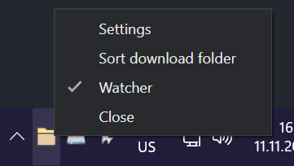

<br/>
<a href="" target="blank_">
    
</a>
<br/>

# Filenest

*I organize your mess, so you don't have to!*

 
## Introduction

Filenest is a small app I made using Electron. It's primarily usage is for me to learn how electron works and what I can do with it. The initial idea came from me, since I'm a data hoarder, and I download stuff all the time. I run into the problem that my download folder got cluttered with a bunch of fluff files. So the idea for Filenest started. 

I made a small nodejs script which would sort all the files in my download folder and put them into the right folder. Then I thought, this would be a great idea to make a GUI For it and make it more accessible to other people, so this app came into existence, hope you enjoy!
## Getting Started 

### Installation 

*__(For Windows)__*

Clone the repo: 

```
git clone https://github.com/alminisl/filenest.git
```
Enter the cloned folder
```
cd filenest
```
Install and start
```
npm install && npm start
```

and the app should be running on Windows in the tray. 


*Tray icon of filenest*


*__(For Linux)__*
` Work in progress..`
*__(For Mac)__*
` Work in progress, don't have a mac so will take some time `

⚠️ Installation files for all the systems should be available in  `Releases` once I Figure out how to build them.


## Usage

When you have started the project and you can see the Tray icon of filenest, it will automatically start the process of sorting files in the download folder so be aware of that! 

When you right click on the tray icon you will get a menu: 




The menu options are the main way to interact with Filenest. The options meaning is as follows: 

- Settings - Opens the settings menu

  - settings menu offers you basic configuration for filenest
  - you can select which file extensions go in what folder 
  
- Sort download folder - triggers the sort download folder function that applies the current settings
- Watcher - toggle it on or off so the selected folder is being watched by filenest, adding/downloading new files results in triggering the sort function.

## Roadmap

- [ ] extend the settings to be more customizable 
- [ ] UI/UX improvements
- [ ] make it so multiple folders can be watched